# Deploying Your Django App on Azure

## Prerequisites
- Have an active Microsoft Azure account with webapp access
- Have your django code already up on github

### Before we start
1. Download and extract [this zip file](https://gist.github.com/jinpark/77193532d04860bcda8b4c66fa6aae8a/archive/4ed5c72c3c187c6c4a7374404e1fa3a62f1583be.zip) and add the contents (`ptvs_virtualenv_proxy.py`, `runtime.txt`, `requirements.txt`, `web.config` ) to your root project folder (same level as `manage.py`) 
2. Add those files to your git repo and push it up to github

### Deploying!
- Visit https://portal.azure.com/

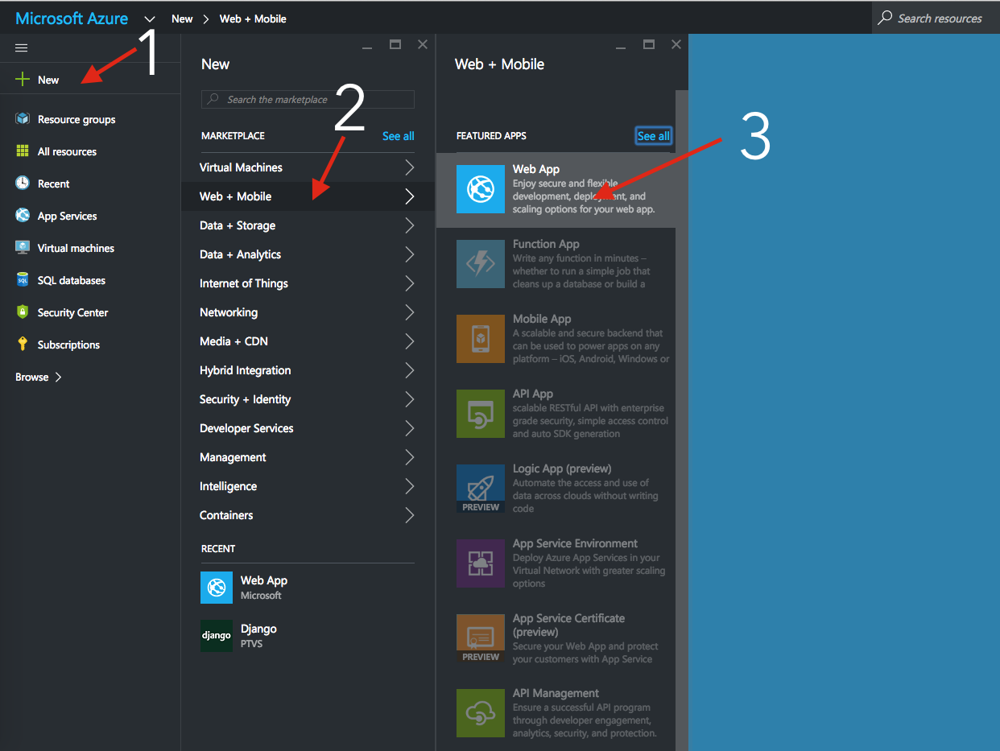

1. Click on `+ New`
2. Click on `Web + Mobile`
3. Click on `Web App`
 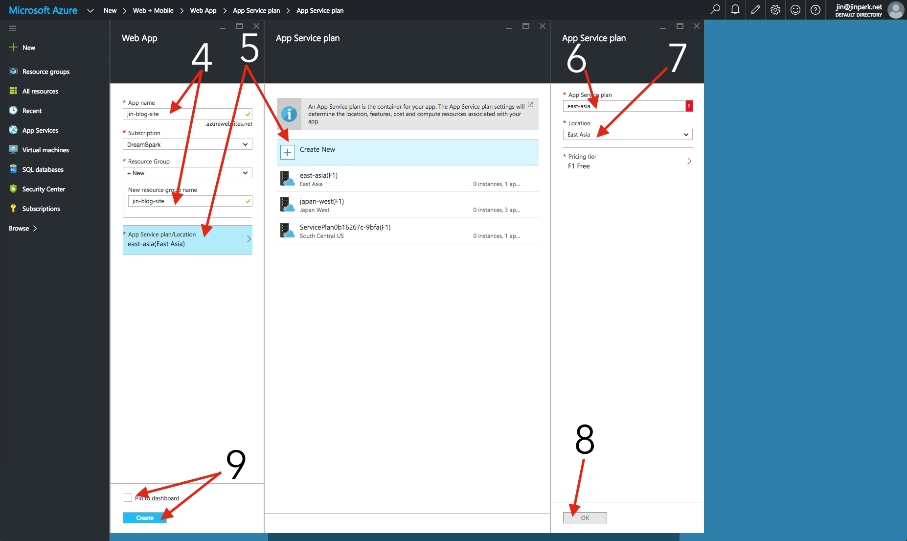
 
4. Change your app name to something you want. The URL will be `whatyouchoose.azurewebsites.net` and add the same name for the `New Resource Group Name`
5. Click on `App Service` and click on `+ Create New` in the next tab
6. Add an `App Service Plan` name. I suggest `east-asia`
7. Click on `Location` and choose `East Asia`
8. Click on `OK`
9. Click on `Pin to dashboard` and then click `Create` and wait :)
 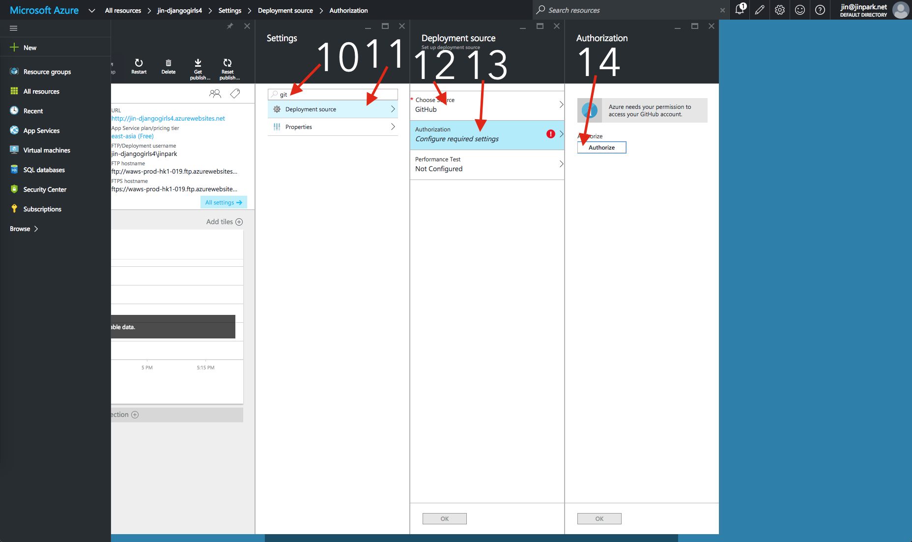
 
10. After the app has been created, type in `github` in the settings search bar
11. Click on `Deployment Source`
12. Click on `Choose Source` and choose `Github` 
13. Click on `Authorization`
14. Click on `Authorize` and click `Approve`
 
 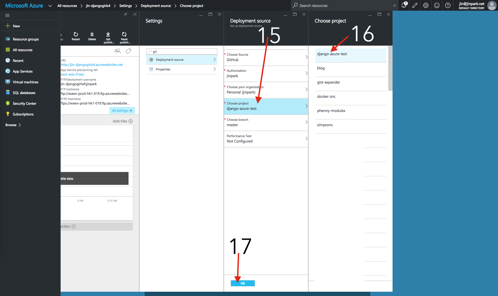
 
15. Click on `Choose Project`
16. Click on your Django Girls blog project on the right side
17. Click on `OK`.
 
 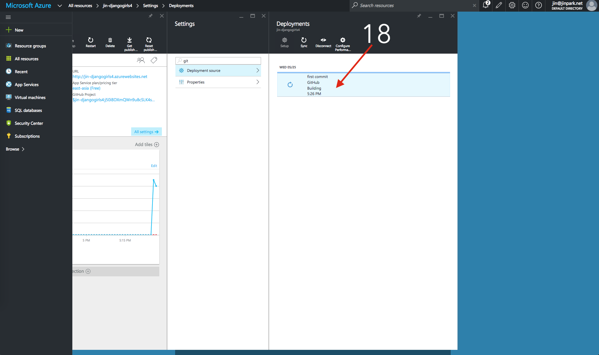
 
18. Wait for your project to build. It will take a few minutes. Take a break!

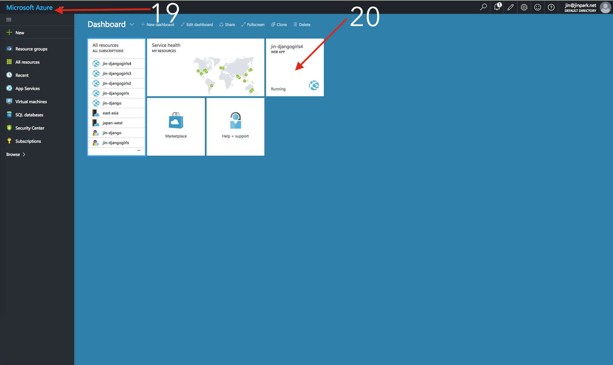

19. Click on the `Microsoft Azure` logo to go back to the dashboard
20. Click on your newly created app.

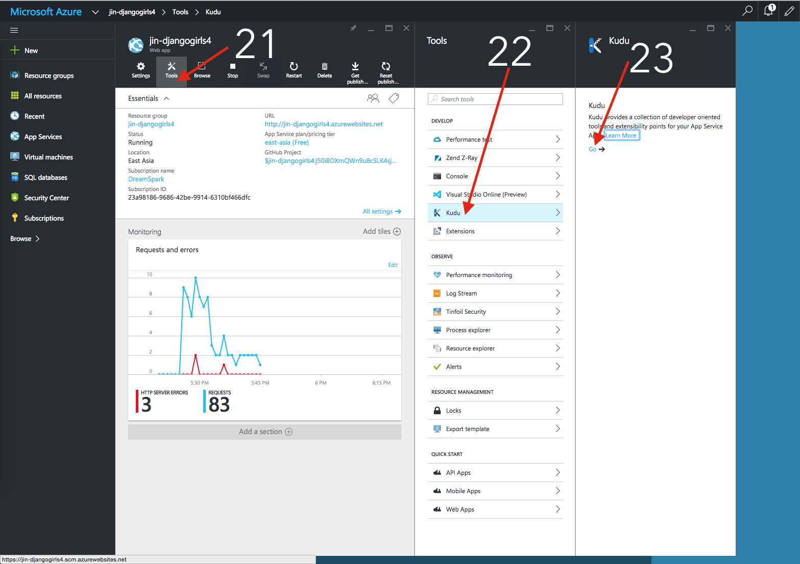

21. Click on `Tools`
22. Click on `Kudu`
23. Click on `Go ->` and it will open a new tab/window.

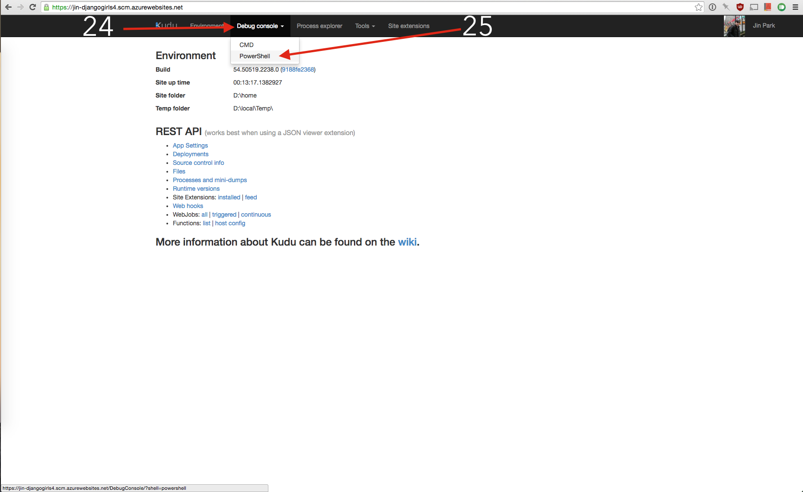

24. Click on `Debug Console`
25. Click on `PowerShell`

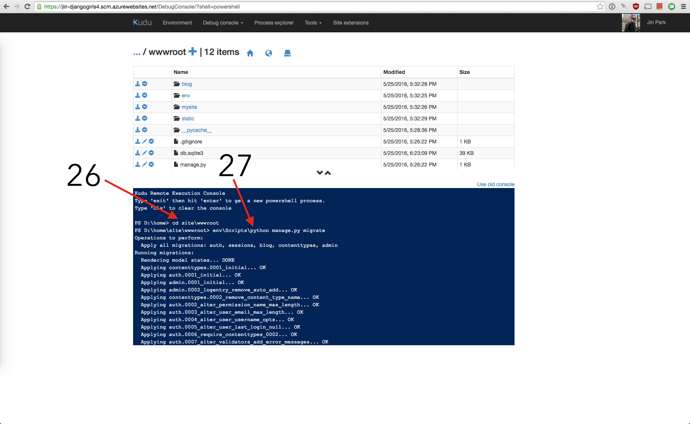

26. Within the console, type in `cd site\wwwroot`
27. Then type in `env\Scripts\python manage.py migrate` and then wait for the migration to finish

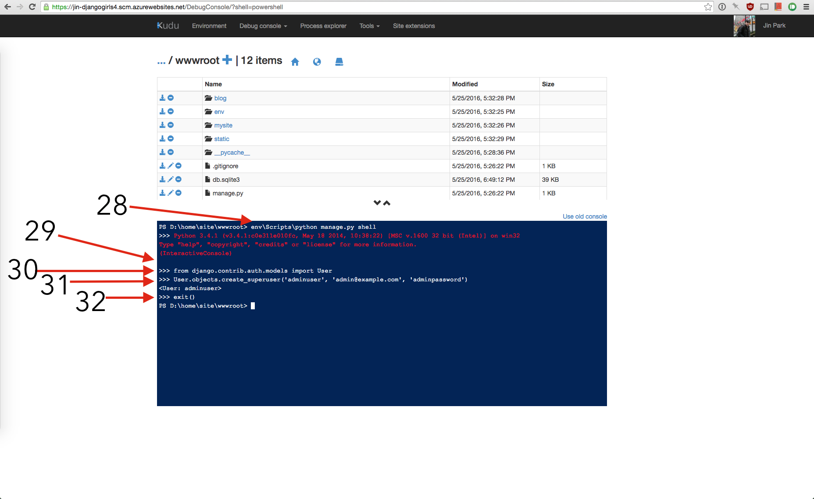

28. To create the superuser on the site, Type in `env\Scripts\python manage.py shell`
29. After `Python 3.4.3 ...` appears, press enter on your keyboard
30. Type in `from django.contrib.auth.models import User` and press enter
31. Type in `User.objects.create_superuser('USERNAME', 'EMAILADDRESS', 'PASSWORD')` MAKE SURE YOU CHANGE THE USERNAME, EMAIL ADDRESS AND PASSWORD. And press enter
32. Type in `exit()` and press enter. Go back to the previous tab/window where the Azure Dashbaord is

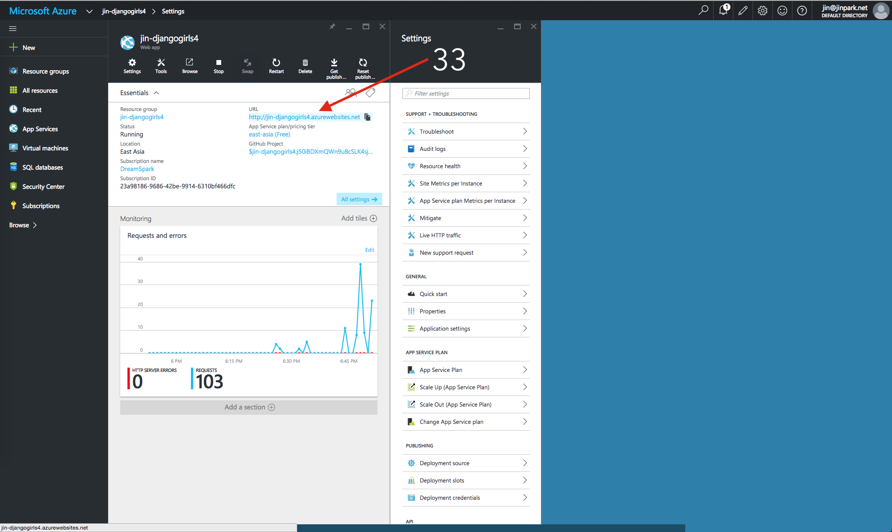

33. Click on the URL and visit your new site LIVE on the internet!
