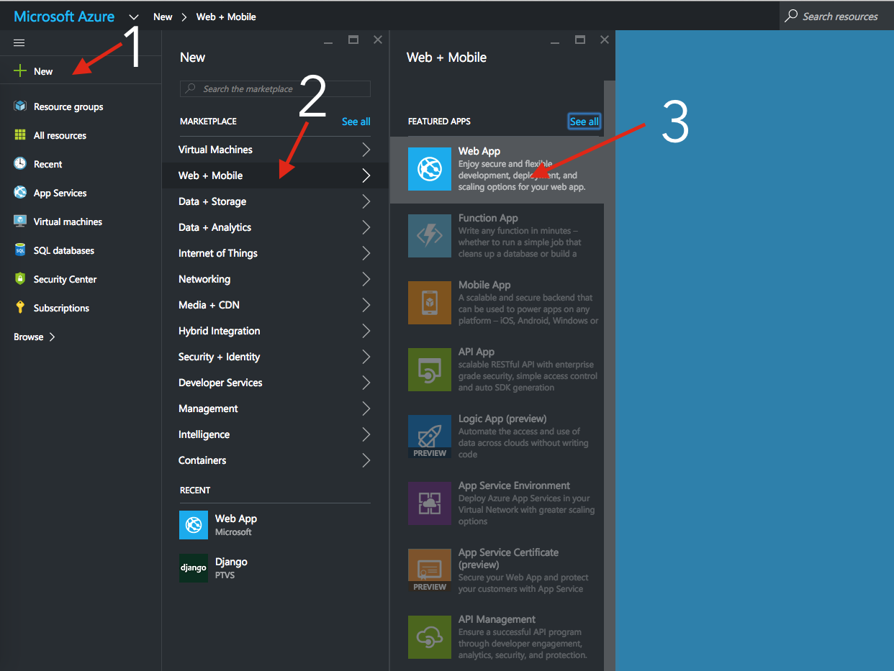

# Deploying Your Django App on Azure

## Prerequisites
- Have an active Microsoft Azure account with webapp access
- Have your django code already up on github

### Before we start
1. Download and extract [this zip file](https://gist.github.com/jinpark/77193532d04860bcda8b4c66fa6aae8a/archive/4ed5c72c3c187c6c4a7374404e1fa3a62f1583be.zip) and add the contents to your root project folder (same level as `manage.py`) 
2. Add those files to your git repo and push it up to github

### Deploying!
0. Visit https://portal.azure.com/ 
1. Click on `+ New`
2. Click on `Web + Mobile`
3. Click on `Web App`
 
 4. Change your app name to 