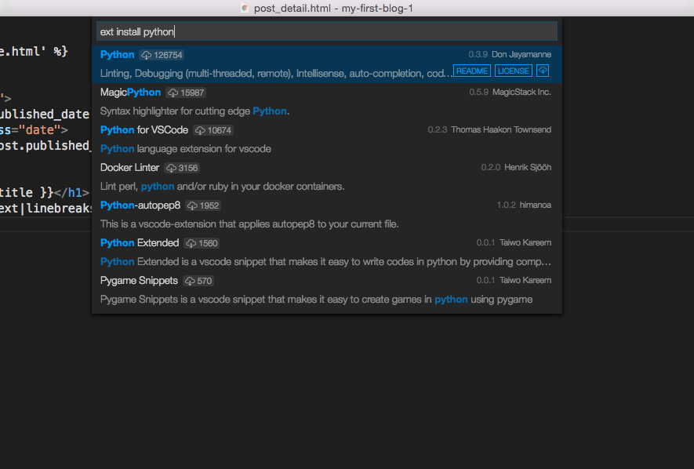
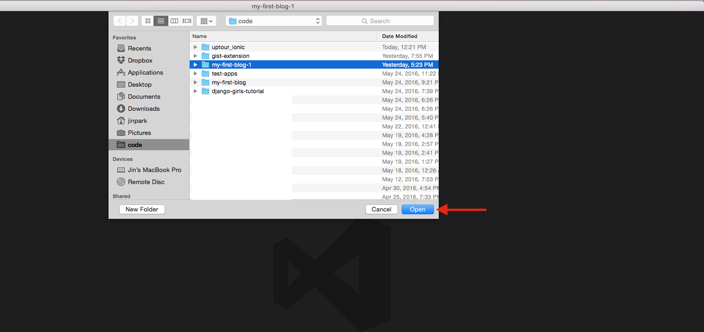
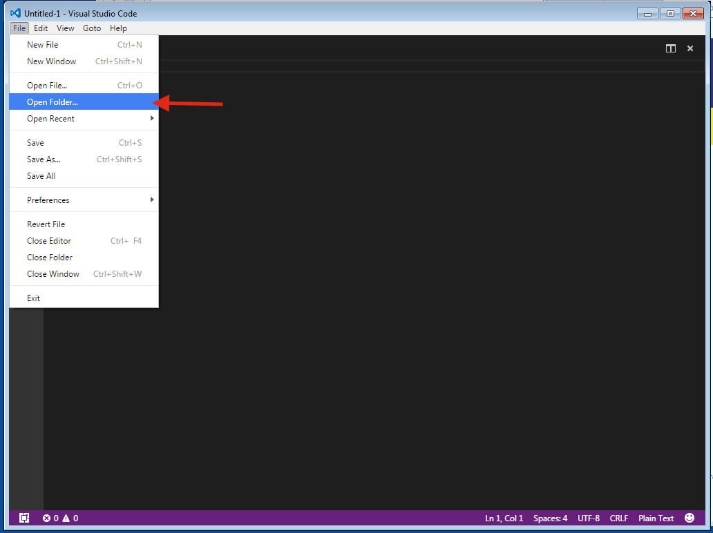

# Visual Studio Code

## Downloading and Installing Visual Studio Code

1. Go to [this link](https://code.visualstudio.com/Download) and download the correct files for your operating system.
2. After installing, open the app.
3. Press ⌘P (for mac) or ctrl+p (for linux/windows) and type in `ext install python`.
4. It will show 

5. Press enter and the python extension will show up

## Tips

- To open a folder so you can see your project files together, (for mac) press `Open` on the folder that you want to open. 
For windows, press `Open Folder`  

- For 